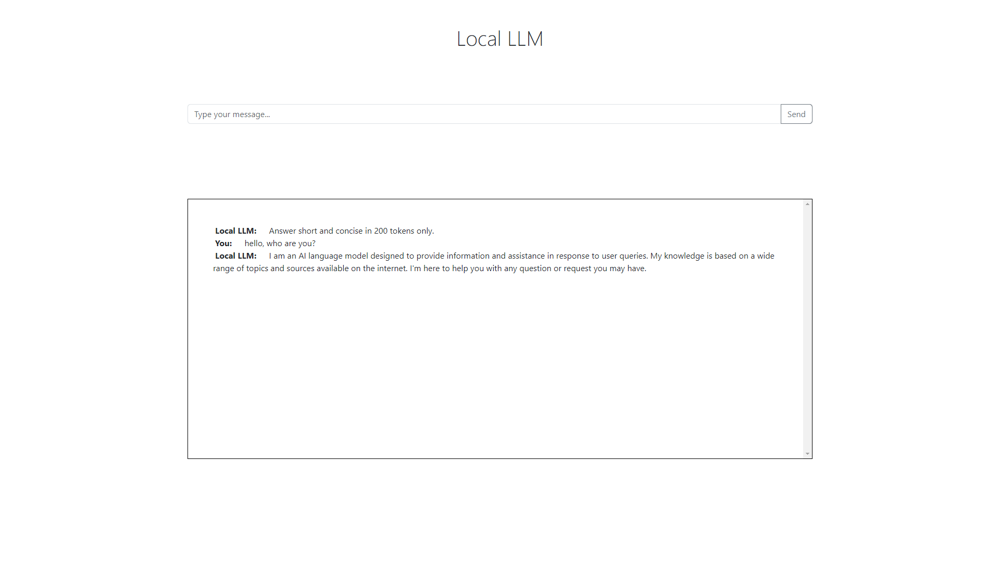

# Local LLM


> A local LLM chatbot

## Preview



## Requirements
- Python 3
- `virtualenv` package

## Installation
- Clone repository
```bash
git clone https://github.com/hardingadonis/local-llm.git
cd local-llm/
```

- Create virtual environment
```bash
virtualenv .venv
```

- Activate virtual environment
```bash
"./.venv/Scripts/activate"
```

- Install dependencies
```bash
pip install -r requirements.txt
```

- Download models
```bash
python server/download_models.py
```

- Run application
```bash
python server/run_server.py
```

## Notes:
- You can download other models. Just make sure to put them in the `server/models` directory.

## Contributors:

<a href="https://github.com/hardingadonis/local-llm/graphs/contributors">
  
</a>

## Licenses:
- [Local LLM](https://github.com/hardingadonis/local-llm) is under the [MIT license](https://github.com/hardingadonis/local-llm/blob/main/LICENSE).